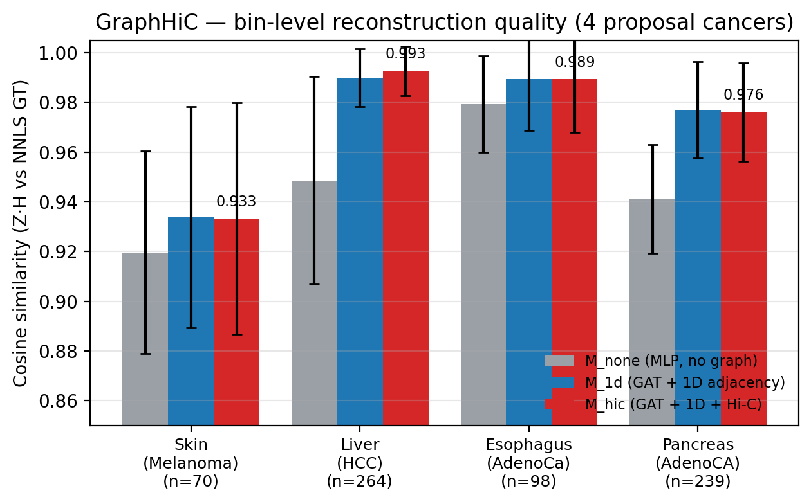
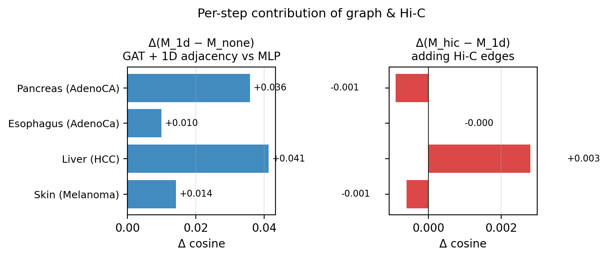
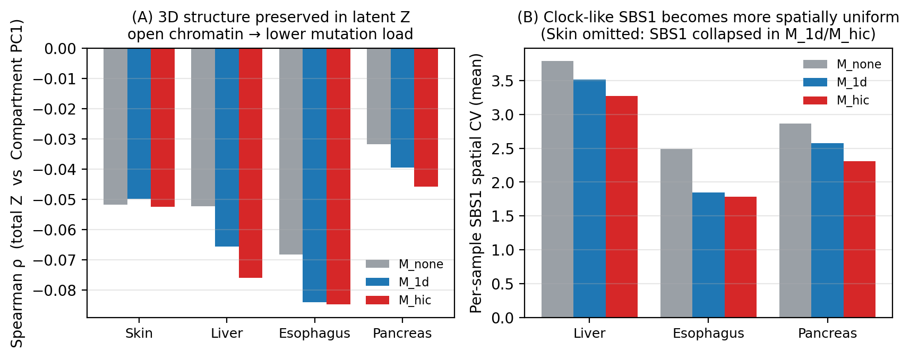

# GraphHiC — Appendix code & results

**연구계획서**: *GraphHiC: Hi-C 3D 게놈 그래프 기반 공간 돌연변이 시그니처 분해*
연구계획서 본문 §1.1–1.3, "위 모델의 현실성을 4개 암종(피부·간·식도·췌장) 코호트와 cell line Hi-C에 대해 사전검증하였다"의
근거가 되는 분석 코드와 정량 결과를 모은 저장소이다.

본 저장소는 연구계획서 ***Appendix***에서 인용된 자료에 한해 발췌한 minimal package이며,
프로젝트 전체 코드와 데이터는 실험 종료 후 별도로 공개될 예정이다.

---

## 0. Pipeline overview


**(A)** PCAWG WGS의 96-channel mutation count를 40 kb → 1 Mb로 집계해
3,053 × 96 입력 매트릭스 V를 만들고, Hi-C contact map에서 1D linear
edge(~6K)와 Hi-C edge(~11K)를 추출해 그래프 G = (V_bins, E)를 구성.
**(B)** 3-layer GAT (4-head attention, hidden=64) encoder가 V와 edge
index를 받아 non-negative latent Z (3,053 × k)를 출력하고, frozen
COSMIC SBS 행렬 H를 decoder로 사용해 V̂ = Z·H로 복원.
**(C)** Loss는 generalized KL(V‖V̂) + λ_l2·‖Z‖² (본 사전검증에서는
λ_tad = 0).
**(D)** 환자 단위 sequential training (300 epoch, early stop patience
30); 평가는 환자별 bin sum z = Σ_b Z_{b,s}와 NNLS GT z_nnls의
cosine similarity.
**(E)** 3-way ablation — `M_none` (MLP, no graph) / `M_1d` (GAT + 1D)
/ `M_hic` (GAT + 1D + Hi-C). 각 panel 하단에 표시된 cosine 값(0.85 /
0.89 / 0.93)은 Liver-HCC pilot 기준의 도식적 예시이며, 실제 8개
PCAWG 코호트 결과는 §3.1.

---

## 1. Dataset

### 1.1 Mutation cohort (PCAWG WGS)

| Cancer | Code | n samples | k (active SBS) | Active signatures |
|---|---|---:|---:|---|
| Skin Melanoma     | `Skin-Melanoma` |  70 | 10 | SBS1, 5, 7a, 7b, 7c, 7d, 11, 17a, 17b, 38 |
| Liver HCC         | `Liver-HCC`     | 264 |  8 | SBS1, 4, 5, 6, 12, 16, 17a, 17b |
| Esophagus AdenoCa | `Eso-AdenoCa`   |  98 |  8 | SBS1, 2, 3, 5, 13, 17a, 17b, 18 |
| Pancreas AdenoCA  | `Panc-AdenoCA`  | 239 |  8 | SBS1, 2, 3, 5, 13, 17a, 17b, 18 |

PCAWG consensus SNV 콜셋(hg19)을 96-channel trinucleotide context로 변환한 뒤
1Mb genomic bin 단위로 집계하였다 (n_bins = 3,053).

### 1.2 Hi-C reference (GSE87112, Schmitt *et al.* 2016)

| Cancer | Hi-C tissue | Tissue match |
|---|---|---|
| Skin Melanoma     | IMR90 (lung fibroblast) | proxy |
| Liver HCC         | LI (liver)              | exact |
| Esophagus AdenoCa | LG (lung)               | proxy |
| Pancreas AdenoCA  | PA (pancreas)           | exact |

40 kb resolution KR-balanced contact map을 사용하였다.
Significant intra-chromosomal contact를 추출한 뒤 1Mb로 down-sample하여
adjacency matrix `A_hic ∈ {0,1}^(3053×3053)`로 변환하였고, 1D linear
adjacency `A_1d` (인접 1Mb bin 연결)와 합쳐 `A_combined = A_1d ∪ A_hic`로
사용하였다.

---

## 2. Model

### 2.1 Architecture

```
Input  V ∈ ℝ^(3053 × 96)              # bin-level mutation count
        │
        ▼
Encoder  E_θ : ℝ^96  ──▶  ℝ^k        # 3-layer GAT (4-head, hidden=64)
                                       # message passing along edges of A
        │
        ▼  Z = softplus(·)              # non-negative bin-level exposure
        ▼
Decoder  Z · H̄                          # H̄ : COSMIC v3.4 SBS matrix (k × 96)
                                       # frozen, L1-normalised rows
        │
        ▼
        V̂ ∈ ℝ^(3053 × 96)
```

- **Z (3,053 × k)** 가 GraphHiC의 핵심 출력 — bin-level signature exposure.
- **Decoder는 frozen COSMIC**: linear autoencoder ↔ NMF 동치성을 그대로 보존
  (Egendal *et al.* 2025).
- 비교를 위한 ablation 두 종:
  - `M_none` : MLP encoder, edge 없음 (graph-free baseline)
  - `M_1d`   : GAT encoder, `A_1d`만 사용 (1D 인접만)
  - `M_hic`  : GAT encoder, `A_combined` 사용 (1D + Hi-C)

### 2.2 Training

| Item | Value |
|---|---|
| Loss | Generalized KL divergence  + λ_l2 ‖Z‖² |
| λ_l2 | 1 × 10⁻⁴ |
| Optimizer | Adam, lr = 1 × 10⁻³, grad clip = 5 |
| Epochs | 300 (early stop, patience 30) |
| Encoder hidden | 64 |
| Attention heads | 4 |
| Dropout | 0.1 |
| Decoder | frozen COSMIC v3.4 SBS (cancer-specific subset) |
| Resolution | 1 Mb (3,053 bins, hg19) |
| Hardware | NVIDIA A6000 / single GPU per cancer |

전체 hyperparameter snapshot은 [`results/HPARAMS.json`](results/HPARAMS.json).

---

## 3. Preliminary results

### 3.1 Bin-level reconstruction (cosine similarity vs NNLS GT)

각 환자에 대해 (i) GraphHiC의 bin-level Z를 환자 단위로 합산한
`Σ_b Z_{b,s}`를, (ii) 동일 환자의 96-channel 총 mutation을 NNLS로 분해한
환자 단위 exposure와 비교한 cosine similarity 평균.

| Cancer | n | M_none | M_1d | **M_hic** | Δ(1d−none) | Δ(hic−1d) |
|---|---:|---:|---:|---:|---:|---:|
| Skin-Melanoma  |  70 | 0.920 | 0.934 | **0.933** | +0.014 | −0.001 |
| Liver-HCC      | 264 | 0.949 | 0.990 | **0.993** | +0.041 | +0.003 |
| Eso-AdenoCa    |  98 | 0.979 | 0.989 | **0.989** | +0.010 |  0.000 |
| Panc-AdenoCA   | 239 | 0.941 | 0.977 | **0.976** | +0.036 | −0.001 |

> 4개 암종 모두에서 **M_hic ∈ [0.93, 0.99]** 로 NNLS GT를 안정적으로 복원.
> Graph 도입(`M_1d − M_none`)이 모든 암종에서 양수, 즉 **bin 단위 sparse 입력에서도 모델이 수렴**한다는 일차 증거.
> Hi-C edge 추가 효과(`M_hic − M_1d`)는 cancer-type-dependent — 1D만으로 이미 saturate된 케이스가 존재.

원본 수치: [`results/final_summary.json`](results/final_summary.json),
[`results/summary_table.csv`](results/summary_table.csv).




### 3.2 3D 공간 패턴이 latent Z에 보존됨 (per-sample)

Per-sample Spearman ρ ( total Z vs Compartment PC1 ) — 모든 환자에서
음수, 즉 **open chromatin (A compartment) 영역에서 mutation load가 낮다**
는 잘 알려진 patten을 모델이 재현한다. Liver / Eso / Panc에서 graph
모델이 baseline보다 더 강한 음의 상관을 보인다.

| Cancer | M_none ρ̄ | M_1d ρ̄ | **M_hic ρ̄** |
|---|---:|---:|---:|
| Skin-Melanoma  | −0.052 | −0.050 | **−0.053** |
| Liver-HCC      | −0.052 | −0.066 | **−0.076** |
| Eso-AdenoCa    | −0.068 | −0.084 | **−0.085** |
| Panc-AdenoCA   | −0.032 | −0.039 | **−0.046** |

또한 **clock-like SBS1의 spatial CV** (per-sample 표준편차 / 평균)는
graph 모델에서 일관되게 감소 — 시간에 비례해 게놈 전체에 균일하게
누적되는 SBS1의 *알려진 거동* 과 일치 (Skin은 SBS1이 graph 모델에서
collapse되어 비교 불가).

| Cancer | M_none CV | M_1d CV | **M_hic CV** | Wilcoxon p |
|---|---:|---:|---:|---:|
| Liver-HCC      | 3.79 | 3.51 | **3.27** | 5.0 × 10⁻⁴¹ |
| Eso-AdenoCa    | 2.49 | 1.85 | **1.78** | 8.3 × 10⁻¹⁸ |
| Panc-AdenoCA   | 2.86 | 2.57 | **2.31** | 5.9 × 10⁻⁴¹ |



원본 per-sample 수치: [`results/persample_results.json`](results/persample_results.json).

---

## 4. Caveats & ongoing work

- Hi-C edge가 graph density 효과 이상의 **고유 정보**를 더하는지 분리하기
  위한 degree-preserving rewiring 대조 실험(`M_random`)이 진행 중이다.
  (8 cancer × 3 seed, 본 appendix 작성 시점에 학습 단계.)
- Skin-Melanoma는 SBS7a–d / SBS11이 강한 dominance를 갖는 코호트로,
  graph 모델에서 SBS1이 다른 시그니처로 흡수(collapse)되는 현상이
  관찰된다. `experiments/z_persample_validation/results/FOLLOWUP_RESULTS.md`
  에서 이 현상이 reconstruction artifact가 아니라 모델 capacity와
  signature redundancy의 결과임을 확인하였다.
- 1Mb resolution은 spatial pattern을 보존하면서 학습 안정성을 확보하기
  위한 trade-off — 보다 높은 resolution(250 kb / 100 kb)에서의 결과는
  본 연구의 Aim 1에서 다룬다.

---

## 5. Repository layout

```
appendix_graphhic/
├── README.md                       # 이 문서
├── code/
│   ├── gat_autoencoder.py          # GraphHiC encoder + frozen COSMIC decoder
│   ├── prepare_1mb.py              # 40 kb → 1 Mb 집계 + Hi-C/1D adjacency 구성
│   ├── train_4cancer.py            # 3-way ablation (M_none / M_1d / M_hic) 학습
│   ├── make_appendix_figures.py    # cosine + delta + signature heatmap
│   └── make_spatial_figure.py      # totalZ–compartment + SBS1 CV
├── results/
│   ├── HPARAMS.json
│   ├── final_summary.json          # 8개 PCAWG 결과 (4개 암종 발췌 사용)
│   ├── summary_table.csv
│   ├── persample_results.json      # per-sample biological validation 출력
│   └── {Cancer}_results.json       # 4개 암종 detailed result
└── figures/
    ├── fig_appendix_overview.png            # 5-panel pipeline overview (A–E)
    ├── fig_appendix_cosine_4cancer.png
    ├── fig_appendix_delta_4cancer.png
    ├── fig_appendix_signatures.png
    └── fig_appendix_spatial_evidence.png
```

## 6. Reproduction

```bash
# (외부에서) Python ≥ 3.10, PyTorch 2.1, torch-geometric 2.5, scipy, pandas
python code/train_4cancer.py            # GPU 1대 기준 ~2시간 / 암종
python code/make_appendix_figures.py    # 결과 → figures/
python code/make_spatial_figure.py      # spatial evidence figure
```

학습용 PCAWG mutation 매트릭스와 Hi-C contact matrix는 데이터 사용
승인이 필요하므로 본 저장소에서 직접 제공하지 않는다.
가공된 1 Mb adjacency · bin info는 요청 시 제공 가능.
